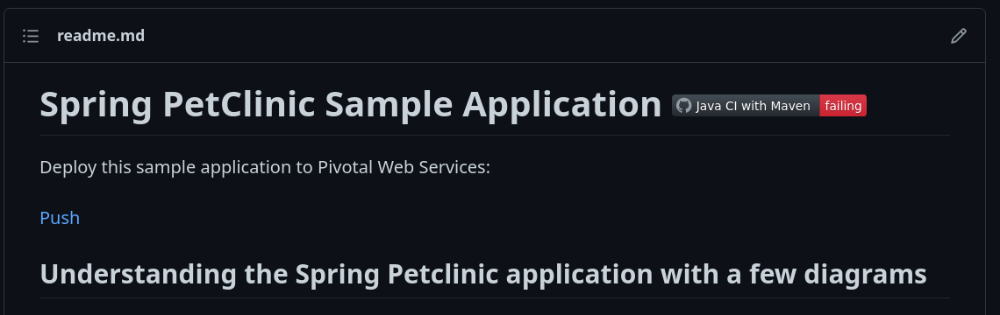

# Instructions
Sampson Traenkle; ID:1802863

**TODO:** Add your screen captures to a new directory called [images](images).
OK!
**HINT:** Embed your screen captures as requested in the sections below. You can embed the image using the following syntax:

```

```

The first argument is the Alt-text for the image. The second argument is the path to the image. Make sure your images are readable and that you save them in a JPG or PNG format.

5 pts Your GitHub account showing that is has been forked from the depaulcdm/spring-petclinic repository. This doesn’t actually need an image – I can see it from your repository.

5 pts Your GitHub Actions dashboard showing a successful first build.

5 pts Your GitHub repository with the readme.md file selected showing the code that you changed to update the badge.

5 pts Your GitHub repository with the readme.md file selected showing the build success status after you’ve updated the badge markdown.

5 pts The section of the POM file showing the coordinates after you’ve commented them out.

5 pts Your GitHub Actions dashboard showing the unsuccessful build after the breaking change.

5 pts Your GitHub repository with the readme.md file selected showing the build failed status after the GitHub workflow fails.

5 pts The section of the POM file showing the coordinates after you’ve fixed them.

5 pts Your GitHub Actions dashboard showing the successful build after the breaking change has been fixed.

5 pts Your GitHub repository with the readme.md file selected showing the build success status after the GitHub workflow has recovered.

